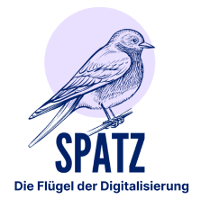
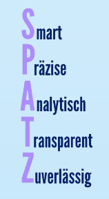
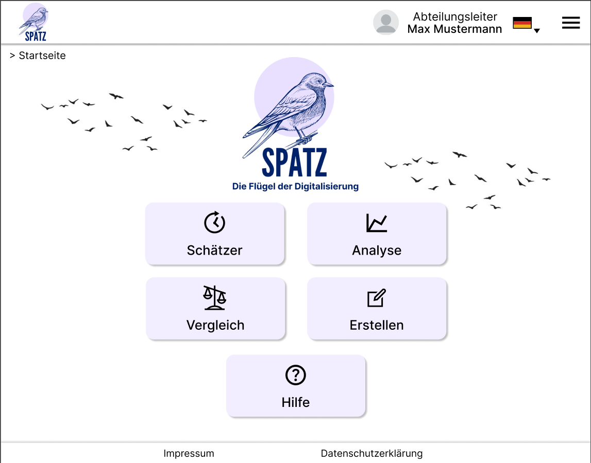

# SPATZ - Die Flügel der Digitalisierung

#### Credits: Bruno Engelhardt, Elisabeth Hens, Christin Körner, Jonas Greim

SPATZ ist ein Universitätsprojekt aus dem wirtschaftwissenschaftlichen Modul  „Business Innovation“.
Ziel des Kurses war es, eine Lösung für den jeweiligen Industriepartner zu finden und diese Lösung in Form von einen Start-up zu präsentieren.
Der Partner dieses Projekts war eine Stadt. 

### Probleme der Stadt (betrifft alle Städte in Deutschland)
- Digitalisierung der Bürgerservices (nach dem Online Zugangsgesetz (OZG) eigentlich bis Ende 2022)
- Digitalisierungsfortschritt nicht einsehbar/planbar -> Kosten/Zeit nicht einschätzbar -> Probleme bei den Anträgen
- Kein Übersicht über alle Projekte
- Bisheriges (Digitalisierungs-) Reifegradmodell nur manuell über Excel-Tabellen
- Keine gute Transparenz und Bürgerpartizipation

### Lösung

Der SPATZ ist ein ganzheitliches Programmmanagement-Tool zur Reifegradmessung, welches Behörden den Weg zur Digitalisierung erleichtert. 
Durch die kontinuierliche und automatisierte Reifegradmessung, an der alle Stakeholder beteiligt sind, schafft er Transparenz und 
ermöglicht einen sinnvollen Einsatz der Fördergelder.

Mehr Infos gibt es in dem [Handout](./documents/SPATZ_Handout.pdf) und der [Präsentation](./documents/SPATZ_Presentation.pdf).

### Prototyp:
[Figma-Protyp: Klicke hier](https://www.figma.com/proto/2eCR1cUb87d80SzeCqxrvA/firstIdeas?type=design&node-id=234-826&t=qXortAMhy1KwIjtK-1&scaling=scale-down&page-id=0%3A1&starting-point-node-id=234%3A826)

